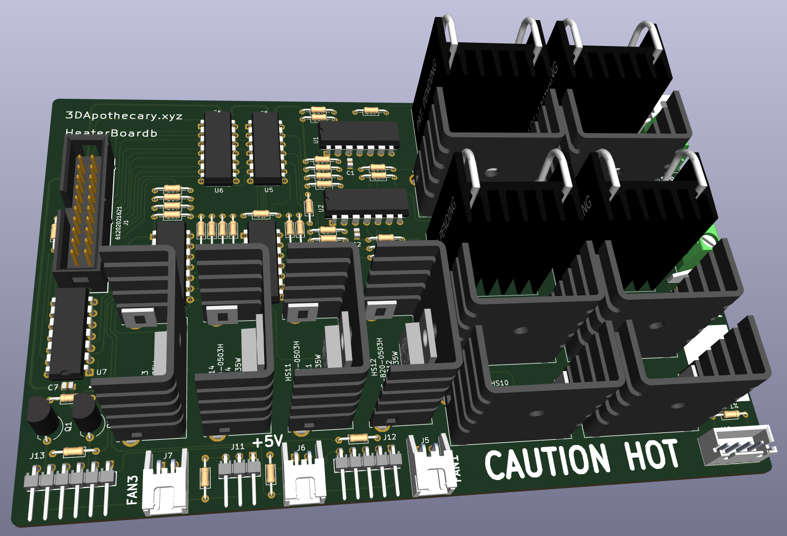
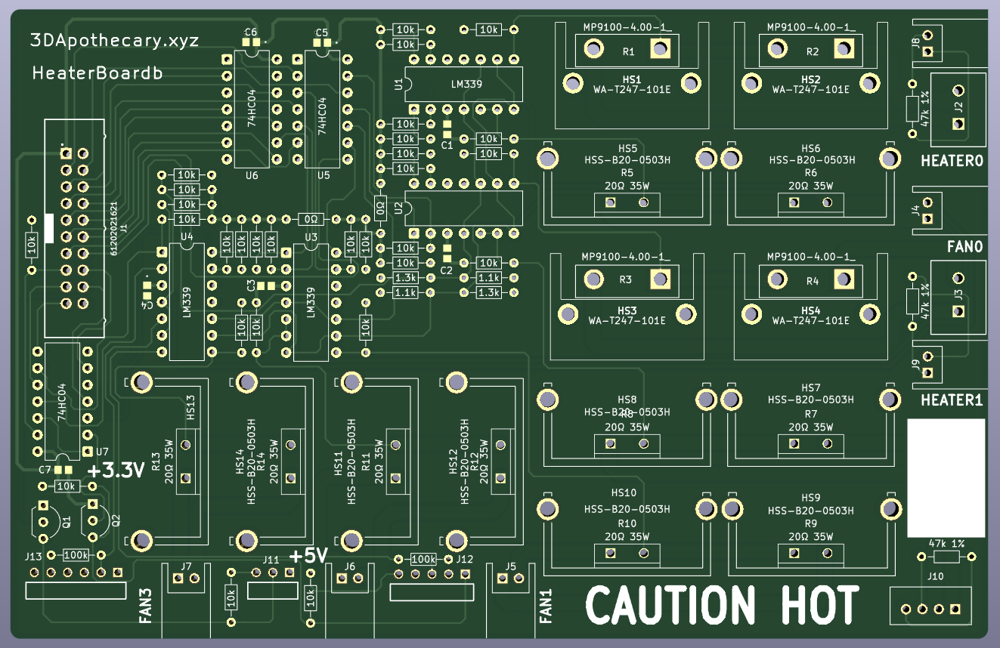
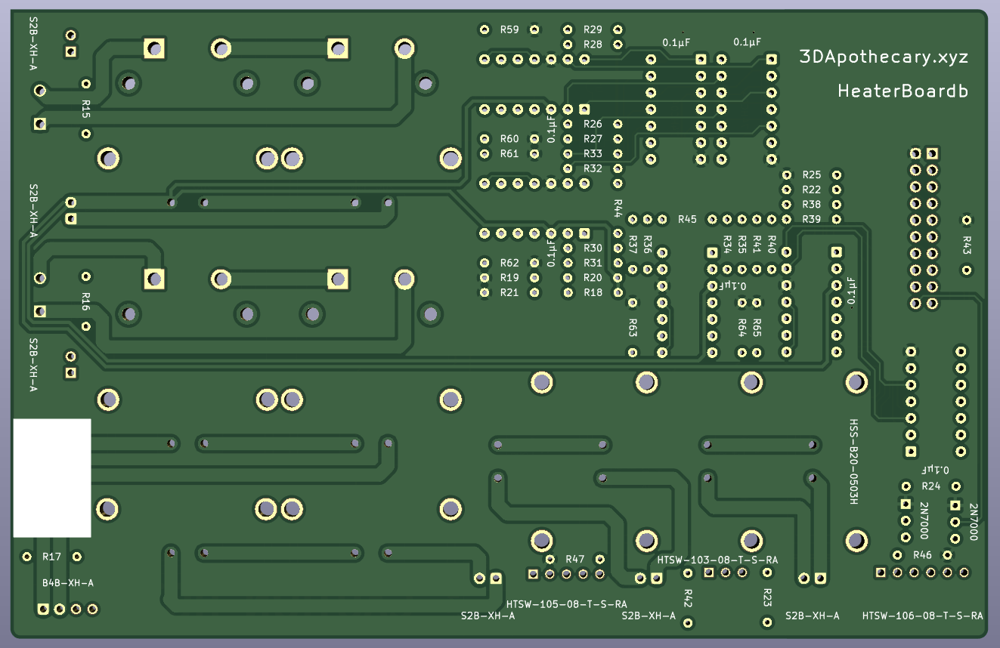

# HeaterBoardb

The HeaterBoardb board was designed for functionally testing 3DApothecary.xyz's [KGP 4x2209](https://github.com/3dApothecary-xyz/KGP_4x2209) with a specific focus on the Heater and Fan drivers.  

Interfaces built into the PCB include:
* 20pin HeaterBoardb Ribbon Cable Connector
* 2x Screw Terminal Connections to Heater Driver Test Resistors
* 4x 2pin JST XH Fan Driver Test Resistor Networks
* 2x 2pin JST XH Thermistor Test Resistor
* 4pin JST XH XH Fan Driver Resistor Network/Thermistor Test Resistor
* 3pin Header for Inductive Probe Test
* 5pin Header for BLTouch Servo/Probe Pin Test
* 6pin Header for ADXL345/SPI Chip Select OR MOSI Logic Gate Test

## WARNING!!!

The 4Ω Resistors used for the Heater Driver Test and the 20Ω Resistors used for the Fan Driver Test can get hot very quickly.  The Functional Test code has a 20 second timeout to minimize the chance for dangerously high temperatures to be reached during operation.  The board was designed for large heatsinks on the Heater and Fan Test Resistors to help keep the temperature down during operation.  

[HeaterBoardb Schematics](schematic/HeaterBoardb_Schematics.pdf)

---

